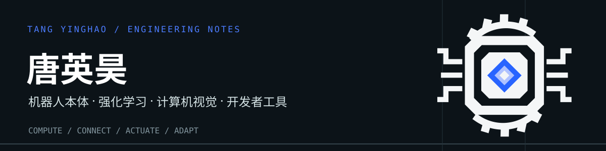
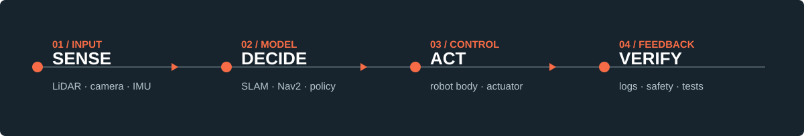

  

  

  
  
  
  
  
  

## 你好，我是唐英昊

我做机器人本体适配、强化学习与计算机视觉，也喜欢把开发者工具做成真正可用的软件。目前关注具身智能从仿真策略到机器人控制的工程链路，以及四足机器人从传感器、定位导航到执行器的系统集成。

工作中的消防机器人项目涉及公司内部实现，这里只介绍公开层面的工程经验；下方项目均可访问公开仓库。

| 方向 | 我关注的问题 | 技术关键词 |
| --- | --- | --- |
| **机器人本体与系统** | 传感器时序、坐标系、控制权和失效保护如何协同 | ROS1 / ROS2、SLAM、Nav2、Jetson |
| **强化学习与 Sim2Real** | 训练环境与本体观测如何对齐，策略怎样进入安全控制链 | Isaac Lab、Python、C++ |
| **计算机视觉** | 让检测模型进入可运行、可调试的完整应用 | PyTorch、YOLO、OpenCV、PyQt6 |
| **开发者工具** | 将 AI 能力接进日常编码与桌面工作流 | TypeScript、VS Code API、Electron |

## 代表作品

| 项目 | 工程重点 | 仓库 |
| --- | --- | --- |
| **Pedestrian Detection System** | YOLOv8 + PyQt6 行人检测桌面系统，包含视频推理、预警与日志 | [查看源码](https://github.com/XiaChiandXuce/PedestrianDetectionSystem) |
| **NEXAIDE** | 探索代码上下文与 AI 对话如何融入 VS Code 扩展 | [查看源码](https://github.com/XiaChiandXuce/NEXAIDE) |
| **DeepSeek Harness Desktop** | 非官方 Windows 桌面封装，关注运行时打包与本地服务交付 | [查看源码](https://github.com/XiaChiandXuce/deepseek-harness-desktop-windows) |

## 工程方法

  

先保存可复现输入，再检查时钟、坐标和数据质量；明确模块边界后做隔离测试，最后与现场行为对照。`Topic` 有消息不等于点云或 IMU 能直接进入 SLAM。运动和喷射控制还要回答：谁拥有控制权，以及取消、掉线或故障后系统停在哪里。

## GitHub 活动

  

  

## 找到我

[GitHub 项目](https://github.com/XiaChiandXuce?tab=repositories) · [CSDN 技术文章](https://blog.csdn.net/tang7mj)

工作项目的 ROS2 迁移与真机验证仍在推进中。本页不展示公司源码、内部数据或未经验证的性能指标。视觉效果参考 [BEPb 的 Profile 仓库](https://github.com/BEPb/BEPb)；动态卡片由第三方服务提供，若服务不可用，文字内容仍可正常阅读。
